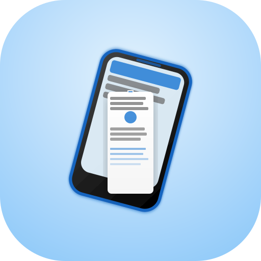
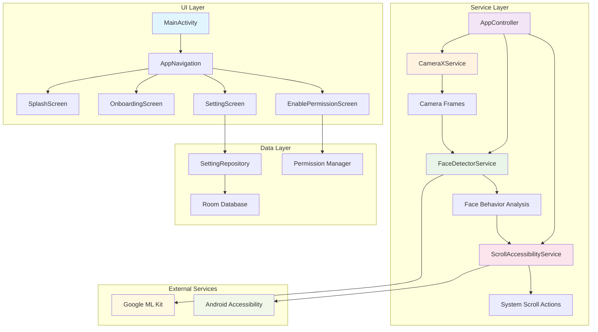
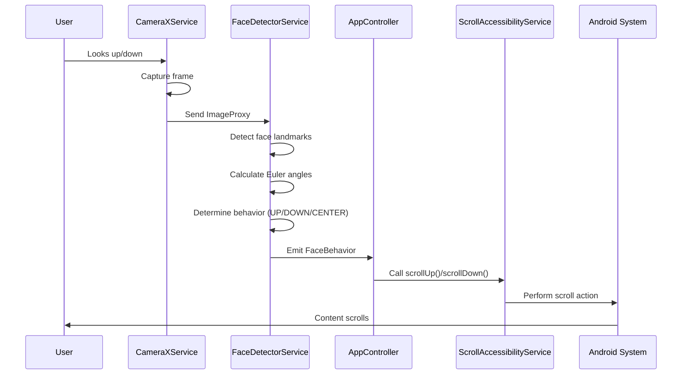

<div align="center">
  
  <h1>FluentRead</h1>
  <p><strong>Hands-free scrolling through eye-tracking technology</strong></p>
</div>

---

**FluentRead** is an innovative Android application that revolutionizes the reading experience through hands-free scrolling using eye-tracking technology. Simply look up or down to scroll through content, making it perfect for accessibility and hands-free reading scenarios.

## 🚀 Features

### Core Functionality
- **Eye-Tracking Scrolling**: Scroll content by looking up or down using real-time face detection
- **Cross-App Compatibility**: Works system-wide through Android Accessibility Services
- **Real-Time Processing**: Continuous camera feed processing with optimized performance
- **Privacy-First**: All processing happens locally on your device - no data sent to external servers

### User Experience
- **Intuitive Onboarding**: Step-by-step setup with permission management
- **Modern UI**: Built with Jetpack Compose and Material Design 3
- **Responsive Design**: Smooth animations and transitions
- **Permission Management**: Clear explanation of required permissions

## 🛠️ Technical Stack

- **Language**: Kotlin
- **UI Framework**: Jetpack Compose
- **Architecture**: MVVM with Clean Architecture principles
- **Dependency Injection**: Dagger Hilt
- **Camera**: CameraX for real-time camera processing
- **ML/AI**: Google ML Kit Face Detection
- **Database**: Room for local data persistence
- **Navigation**: Navigation Compose
- **Accessibility**: Android Accessibility Services

## 📱 How It Works

1. **Face Detection**: Uses Google ML Kit to detect facial landmarks and head orientation
2. **Behavior Analysis**: Analyzes head Euler angles to determine if you're looking up or down
3. **Scroll Control**: Converts eye movements into scroll actions via Accessibility Services
4. **Cross-App Integration**: Works with any scrollable content across different apps

## 🔧 Installation & Setup

### Prerequisites
- Android 7.0 (API level 24) or higher
- Camera permission
- Accessibility Service permission

### Build Instructions

1. **Clone the repository**
   ```bash
   git clone https://github.com/[your-username]/FluentRead.git
   cd FluentRead
   ```

2. **Open in Android Studio**
   - Import the project
   - Sync Gradle files
   - Build the project

3. **Install on device**
   ```bash
   ./gradlew installDebug
   ```

### First Time Setup

1. **Launch the app** - You'll see the splash screen
2. **Complete onboarding** - Learn about the app's features
3. **Grant permissions**:
   - **Camera Permission**: Required for eye tracking
   - **Accessibility Service**: Required for cross-app scrolling
4. **Start using** - The app will begin tracking your eye movements

## 🏗️ Project Structure

```
app/src/main/java/com/example/fluentread/
├── features/
│   ├── splash/           # Splash screen
│   ├── onboarding/       # Onboarding flow
│   ├── settings/         # App settings
│   └── components/       # Reusable UI components
├── service/
│   ├── camera/           # CameraX integration
│   ├── mlk/              # ML Kit face detection
│   ├── accessibility/    # Accessibility service
│   └── overlay/          # UI overlay components
├── cache/                # Room database
├── di/                   # Dependency injection
└── utils/                # Constants and utilities
```

## 🔐 Permissions

### Camera Permission
- **Purpose**: Required for real-time face detection and eye tracking
- **Usage**: Captures camera frames to analyze head orientation
- **Privacy**: All processing happens locally on your device

### Accessibility Service
- **Purpose**: Enables system-wide scrolling functionality
- **Usage**: Monitors screen content and performs scroll actions
- **Scope**: Works across all apps with scrollable content

## 🔄 Service Communication Architecture

The following diagram shows how the different services communicate with each other:



## 🔄 Data Flow Process

The following diagram shows the detailed data flow from camera input to scroll action:



## 🎯 Usage

1. **Enable the service** after granting permissions
2. **Position yourself** in front of the camera
3. **Look up** to scroll up
4. **Look down** to scroll down
5. **Look straight ahead** to stop scrolling

## ⚙️ Configuration

The app includes configurable settings for:
- Sensitivity thresholds for eye movement detection
- Scroll speed and behavior
- Camera settings and optimization

## 🧪 Development

### Key Components

- **FaceDetectorService**: Handles ML Kit face detection and behavior analysis
- **CameraXService**: Manages camera lifecycle and frame processing
- **ScrollAccessibilityService**: Provides system-wide scrolling functionality
- **AppController**: Orchestrates all services and manages app state

### Architecture

The app follows Clean Architecture principles with:
- **Presentation Layer**: Jetpack Compose UI with ViewModels
- **Domain Layer**: Business logic and use cases
- **Data Layer**: Repository pattern with Room database
- **Service Layer**: Background services for camera and accessibility

## 🤝 Contributing

1. Fork the repository
2. Create a feature branch (`git checkout -b feature/amazing-feature`)
3. Commit your changes (`git commit -m 'Add some amazing feature'`)
4. Push to the branch (`git push origin feature/amazing-feature`)
5. Open a Pull Request

## 📄 License

This project is licensed under the MIT License - see the [LICENSE](LICENSE) file for details.

## 🙏 Acknowledgments

- Google ML Kit for face detection capabilities
- Android Accessibility Services for system integration
- CameraX team for camera functionality
- Jetpack Compose for modern UI development

## 📞 Support

If you encounter any issues or have questions:
- Open an issue on GitHub
- Check the documentation
- Review the troubleshooting guide

---

**FluentRead** - Making reading more accessible, one eye movement at a time. 👁️📱
